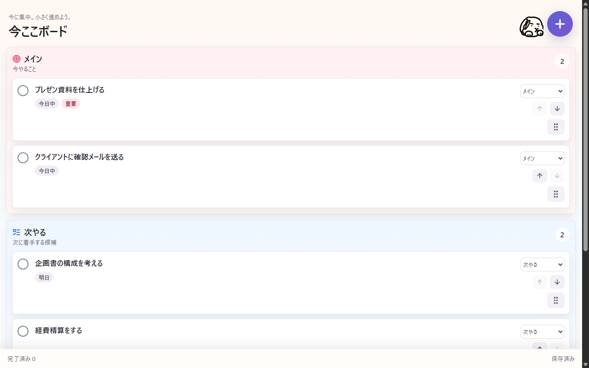

# 今ここボード

Chromeの右側Side Panelに表示する、作業状態を整理するための補助ボードです。



## 主な機能

- 3レーンのタスクボード: メイン、次やる、今は考えない
- タスク追加と現在タブのタスク化
- タスクごとの予定日設定
- ドラッグ＆ドロップでのレーン移動と並び替え
- メインレーンは最大3件まで
- 予定日が今日のタスクを強調表示
- 完了時のうさぎキャラクター付きトースト
- `chrome.storage.local` によるローカル保存

## セットアップ

```bash
npm install
```

## 開発起動

```bash
npm run dev
```

Viteの開発サーバーでSide Panel画面を確認できます。

## ビルド

```bash
npm run build
```

Chromeに読み込む成果物は `dist/` に生成されます。`public/` 配下の画像アセットと `manifest.json` も `dist/` にコピーされます。

## Chromeへの読み込み

1. `npm run build` を実行する
2. Chromeで `chrome://extensions` を開く
3. 右上の「デベロッパーモード」をONにする
4. 「パッケージ化されていない拡張機能を読み込む」をクリックする
5. `dist` フォルダを選択する
6. 拡張アイコンをクリックして右側パネルを開く

## 画像アセット配置

- 拡張機能内で使うアイコン: `public/assets/icons/`
- 完了トーストなどで使うマスコット画像: `public/assets/mascot/`
- READMEやChrome Web Store申請準備で使う素材: `public/assets/store/`

`public/assets/store/` 配下の画像はストア掲載用の管理領域です。拡張機能の実行時には必須にしません。

## 拡張機能用アイコン

`manifest.json` の `icons` と `action.default_icon` は以下を参照します。

- `public/assets/icons/icon16.png`
- `public/assets/icons/icon32.png`
- `public/assets/icons/icon48.png`
- `public/assets/icons/icon128.png`

## マスコット画像

`BunnyMascot` コンポーネントは、SVGコンポーネント実装と画像アセット実装を切り替えられるようにしています。

- SVGコンポーネント版: `variant="svg"`
- 画像アセット版: `variant="image"`
- デフォルト画像: `/assets/mascot/bunny.png`

完了トーストでは画像アセット版のマスコットを使います。

## Chrome Web Store用画像アセット

`public/assets/store/` 配下に、Chrome Web Store掲載用の画像を配置します。

- `screenshots/`: ストア掲載スクリーンショット
- `promo/`: プロモーション画像
- `icon128.png` は `public/assets/icons/` に配置

サイズ一覧:

| 種類 | 配置先 | サイズ |
| --- | --- | --- |
| アイコン | `public/assets/icons/icon128.png` | 128x128 px |
| スクリーンショット | `public/assets/store/screenshots/screenshot-*.png` | 1280x800 px、最低1枚、最大5枚 |
| Small promo | `public/assets/store/promo/small-promo-440x280.png` | 440x280 px |
| Marquee promo | `public/assets/store/promo/marquee-promo-1400x560.png` | 1400x560 px |

推奨スクリーンショット:

1. 今ここボード全体
2. ドラッグ＆ドロップでレーン移動
3. 完了時の「おめでと！」トースト
4. 今のタブをタスク化
5. ローカル保存・外部送信なしの説明画面

注意:

- ストア掲載画像は、ぼやけ・歪み・過度な装飾を避ける
- 実際の機能と一致する画面を使う
- ブランドの見た目をアイコン、スクリーンショット、プロモーション画像で統一する

## スクリーンショット更新

画像やUIを変更したら、`public/assets/store/screenshots/` 配下のストア用スクリーンショットを取り直します。

現在のメインボード画像:

- `public/assets/store/screenshots/screenshot-01-main-board.png`

取り直した後は `npm run build` を実行し、`dist/assets/store/` に反映します。
